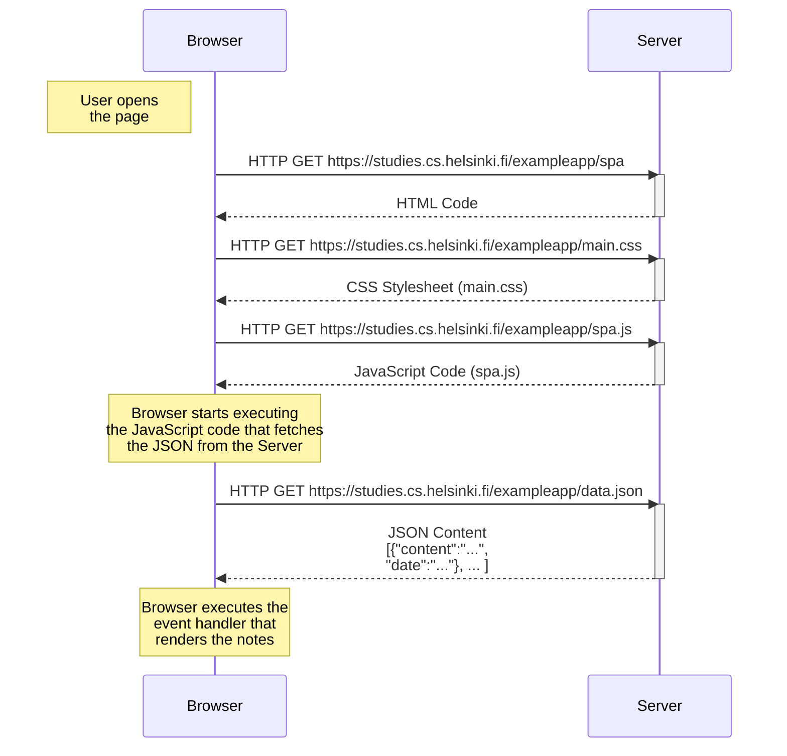

```mermaid
sequenceDiagram
    participant Browser
    participant Server

    Note left of Browser: User opens<br/>the page
    Browser->>Server: HTTP GET https://studies.cs.helsinki.fi/exampleapp/spa
    activate Server
    Server-->>Browser: HTML Code
    deactivate Server

    Browser->>Server: HTTP GET https://studies.cs.helsinki.fi/exampleapp/main.css
    activate Server
    Server-->>Browser: CSS Stylesheet (main.css)
    deactivate Server

    Browser->>Server: HTTP GET https://studies.cs.helsinki.fi/exampleapp/spa.js
    activate Server
    Server-->>Browser: JavaScript Code (spa.js)
    deactivate Server


    Note over Browser: Browser starts executing<br/>the JavaScript code that fetches<br/>the JSON from the Server

    Browser->>Server: HTTP GET https://studies.cs.helsinki.fi/exampleapp/data.json
    activate Server
    Server-->>Browser: JSON Content <br/>[{"content":"...",<br/>"date":"..."}, ... ]
    deactivate Server

    Note over Browser: Browser executes the<br/>event handler that<br/>renders the notes
```
