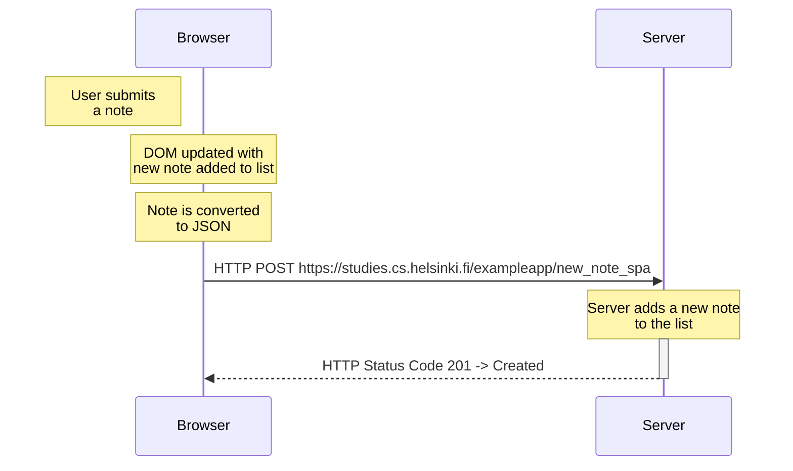

```mermaid
sequenceDiagram
    participant Browser
    participant Server

    Note left of Browser: User submits<br/>a note
    Note over Browser: DOM updated with<br/>new note added to list
    Note over Browser: Note is converted<br/>to JSON
    Browser->>Server: HTTP POST https://studies.cs.helsinki.fi/exampleapp/new_note_spa
    Note over Server: Server adds a new note<br/>to the list
    activate Server
    Server-->>Browser: HTTP Status Code 201 -> Created
    deactivate Server
```
